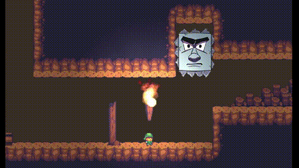

# [Godot] Mad Stone
Enemy scripts for an Angry smashing stone.

## Video sample

## How does it work?
This enemy has 4 states represented by a enum:
 - **IDLE** (watching player)
 - **CHARGING** (short cast before attacking)
 - **MAD** (attacking)
 - **RAISING** (refreshing attack cooldown)

Enemy script is located in [scenes/MadStone.gd](scenes/MadStone.gd), the scene is [scenes/MadStone.tscn](scenes/MadStone.tscn).